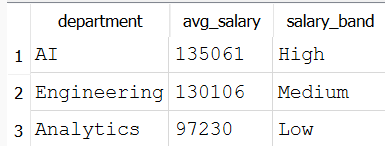

# Job Market Analysis using SQL

## Project goal
Analyse job market salary trends using SQL

## Dataset source
The dataset was sourced from a publicly available job market dataset used for educational analytics practice.

## Rows analysed
32672 rows

## SQL concepts used
- SELECT
- JOIN
- GROUP BY
- HAVING
- CASE
- Subqueries

## Query Result Preview

## Key findings
- AI department has highest average salary
- Analytics has highest number of jobs
- Data Scientist roles lead salary in AI
